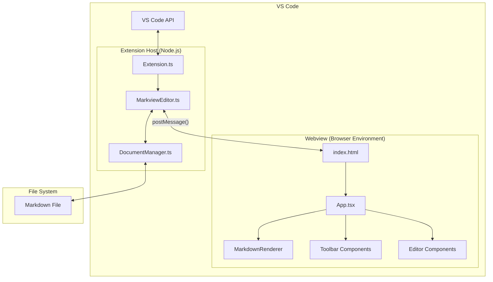

# MarkView Extension Development Plan

## MVP Functionality

Minimum Viable Product (MVP) of MarkView core features:

1. **Basic WYSIWYG Editing** - Real-time rendering of formatted Markdown
2. **Core Markdown Support** - Headers, paragraphs, lists, bold/italic, links, code blocks
3. **VS Code Integration** - Proper custom editor implementation
4. **Simple Formatting Toolbar** - Basic formatting commands
5. **Bidirectional Editing** - Changes in WYSIWYG view update the source and vice versa
6. **Basic Image Display** - Show referenced images

## Development Order

1. **VS Code Custom Editor Setup** - Implement the extension activation and custom editor provider
2. **Markdown Parsing and Rendering** - Integrate Muya or another library for rendering
3. **React WYSIWYG Editor UI** - Create the interactive editor interface with React
4. **Two-way Synchronization** - Ensure changes sync between views
5. **Basic Toolbar** - Implement essential formatting controls with React components
6. **Core Markdown Features** - Support for standard Markdown elements as React components
7. **Image Support** - Basic image display functionality
8. **Initial Settings** - Implement essential configuration options
9. **Testing & Bug Fixing** - Ensure stability across various Markdown files
10. **Documentation** - Write basic usage documentation

## Required Packages

1. **Markdown Engine**

   - `markdown-it` or `remark` - For Markdown parsing and serialization
   - `prosemirror` - Rich text editing framework that works well with React

2. **React and UI Components**

   - `react` & `react-dom` - For building the editor interface
   - `@vscode/webview-ui-toolkit` - React components with VS Code styling
   - `styled-components` - For component styling using CSS-in-JS
   - `@fluentui/react` - Microsoft's React UI library (optional alternative)

3. **React Utilities**

   - `use-immer` or `immer` - For immutable state management
   - `react-icons` - For UI icons
   - `classnames` - For conditional class names

4. **VS Code Integration**

   - VS Code API (already in your template)

5. **Build Tools**

   - `typescript` - Already in your template
   - `esbuild` - For bundling and faster builds
   - `babel` - For React/JSX compilation

6. **Testing**
   - `jest` - For testing framework
   - `@testing-library/react` - For testing React components
   - `vscode-test` - For extension testing

## MVP Project Structure

```
markview/
├── .vscode/                  # VS Code settings
├── src/
|   └── mvp/
│       ├── extension.ts            # Extension entry point
│       ├── editor/                 # Editor implementation
│       │   ├── MarkviewEditor.ts   # Main editor provider
│       │   ├── DocumentManager.ts  # Document state handling
│       │   └── utils.ts            # Editor utilities
│       ├── webview/                # Webview implementation
│       │   ├── index.tsx           # Webview entry point (React)
│       │   ├── App.tsx             # Main React component
│       │   ├── MarkdownRenderer.ts # Markdown rendering
│       │   ├── components/         # React components
│       │   │   ├── Editor/         # Editor components
│       │   │   ├── Toolbar/        # Toolbar components
│       │   │   └── common/         # Shared components
│       │   ├── hooks/              # Custom React hooks
│       │   ├── context/            # React context providers
│       │   └── utils/              # Webview utilities
│       ├── util/                   # Shared utilities
│       └── types/                  # TypeScript type definitions
├── media/                    # Icons, images, etc.
├── webview-ui/               # Webview frontend
|   └── mvp/
│       ├── index.html            # Webview HTML template
│       ├── styles/               # CSS styles
│       └── scripts/              # Webview-specific scripts
├── test/                     # Tests
│   ├── extension/            # Extension tests
│   ├── webview/              # React component tests
│   └── fixtures/             # Test Markdown files
├── package.json              # Extension manifest
├── esbuild.js         # esbuild configuration
└── tsconfig.json             # TypeScript configuration
```

## Best Practices for Production-Grade React Implementation

1. **Use TypeScript Throughout** - Strong typing for React components and props

2. **VS Code Webview Architecture**

   - Implement the VS Code Custom Editors API
   - Use `postMessage` for communication between extension and webview
   - Handle proper serialization and message typing

3. **React Component Architecture**

   - Use functional components with hooks exclusively
   - Implement proper component hierarchy and composition
   - Follow the single responsibility principle for components
   - Use React Context API for state that needs to be accessed by many components
   - Consider using React Suspense for asynchronous operations

4. **State Management**

   - Use React's useState for simple component state
   - Implement useReducer for complex state logic
   - Consider React Context for global state
   - Use immutable state patterns (possibly with Immer)
   - Implement robust undo/redo handling via command pattern

5. **Performance Optimization**

   - Use React.memo for components that render often but rarely change
   - Implement useCallback for event handlers passed to child components
   - Use useMemo for expensive calculations
   - Virtualize large documents when possible
   - Implement proper React key management for lists

6. **Testing Strategy**

   - Unit tests for utility functions
   - Component tests with React Testing Library
   - Integration tests for extension behavior
   - Follow testing best practices (arrange-act-assert pattern)

7. **Security Considerations**

   - Sanitize Markdown input to prevent XSS attacks
   - Implement proper Content Security Policy in webviews
   - Use dangerouslySetInnerHTML sparingly and only with sanitized content
   - Careful handling of external resources

8. **Accessibility**

   - Use semantic HTML elements
   - Implement proper ARIA attributes
   - Ensure keyboard navigation works well
   - Test with screen readers
   - Follow WAI-ARIA practices for complex components

9. **Documentation**

   - Use JSDoc comments for components and functions
   - Document props with TypeScript interfaces
   - Create Storybook stories for UI components (optional)
   - Maintain comprehensive user documentation

10. **Continuous Integration**
    - Set up GitHub Actions for testing React components
    - Implement linting and type checking in CI
    - Add bundle size monitoring
    - Automate releases

## Understanding the VS Code Extension Architecture

The MarkView extension follows the VS Code Custom Editor API pattern, which separates functionality between the extension host (Node.js environment) and the webview (browser-like environment).

## Extension Architecture Diagram

Here's a visualization of how the components work together:


